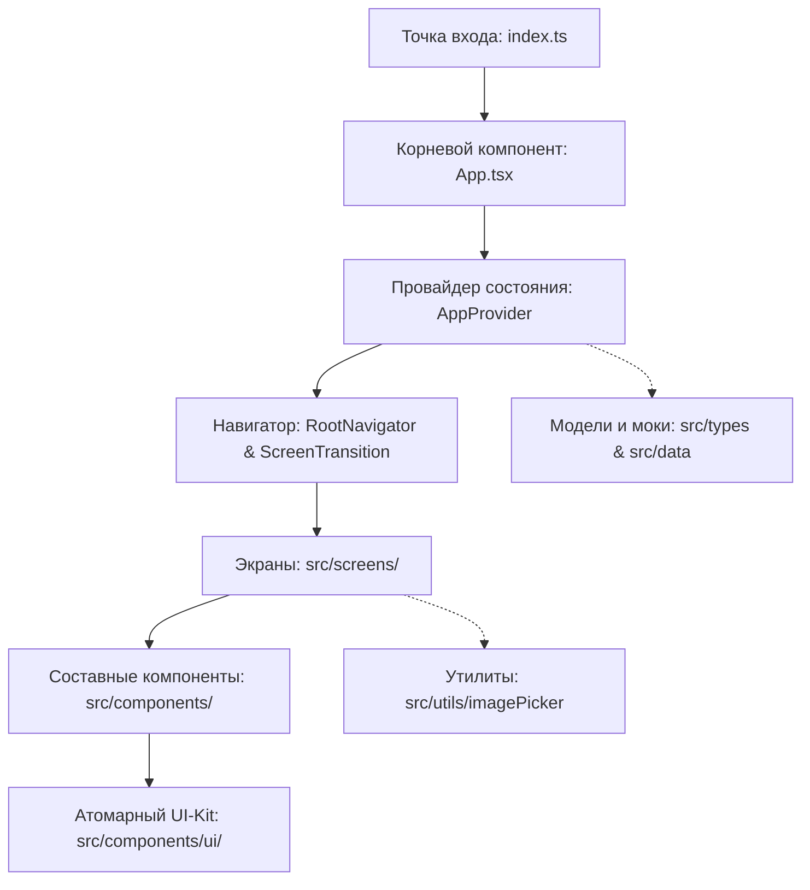

# Архитектура приложения Pinder

Данный документ подробно описывает общую архитектуру, организацию кода, принципы проектирования и потоки данных в проекте **Pinder**.

---

## 1. Обзор архитектуры

Pinder спроектирован по модульному принципу на базе **React Native 0.86** и **Expo SDK 57**. Архитектура оптимизирована для высокой производительности, гладких анимаций 60+ FPS, кроссплатформенной работы (iOS, Android, Web) и отсутствия громоздких сторонних зависимостей.



---

## 2. Структура каталогов

```
pinder/
├── App.tsx                     # Корневой компонент: связывает AppProvider и RootNavigator
├── index.ts                    # Точка запуска Expo
├── app.json                    # Манифест конфигурации приложения Expo
├── tsconfig.json               # Настройки статической типизации TypeScript
├── package.json                # Список библиотек и скриптов запуска
├── docs/                       # Техническая документация и разбор кода
│   ├── ARCHITECTURE.md         # Настоящий документ (архитектура и потоки данных)
│   ├── STATE_MANAGEMENT.md     # Разбор контекста и глобального стейта
│   ├── SCREENS.md              # Подробный разбор каждого экрана
│   ├── COMPONENTS_AND_UIKIT.md # Атомарный UI-Kit и составные компоненты
│   ├── ANIMATIONS_AND_GESTURES.md # Жесты PanResponder, интерполяции и пружины
│   └── DATA_MODELS_AND_UTILS.md   # Модели типов TypeScript и утилиты
└── src/
    ├── types/
    │   └── profile.ts          # Интерфейсы данных (Profile, User, Message, Settings)
    ├── data/
    │   └── mockProfiles.ts     # Начальные данные анкет, чатов, симпатий и тегов
    ├── context/
    │   └── AppContext.tsx      # Глобальное состояние (Redux/Zustand-like React Context)
    ├── utils/
    │   └── imagePicker.ts      # Мост к камере и галерее устройства
    ├── components/
    │   ├── ui/                 # Атомарные компоненты UI-Kit
    │   │   ├── Button.tsx      # Кнопки всех вариаций
    │   │   ├── Input.tsx       # Поля ввода
    │   │   ├── Switch.tsx      # Переключатели
    │   │   ├── Slider.tsx      # Ползунки расстояния и возраста
    │   │   ├── Badge.tsx       # Бейджи и чипы тегов
    │   │   ├── Avatar.tsx      # Аватары со статусом «В сети»
    │   │   ├── SegmentedControl.tsx # Таб-контролы с бейджами
    │   │   ├── Modal.tsx       # Модальные окна и BottomSheet
    │   │   └── index.ts        # Баррель-экспорт UI-Kit
    │   ├── Icons.tsx           # Библиотека векторных SVG-иконок
    │   ├── Header.tsx          # Верхняя панель ленты
    │   ├── Card.tsx            # Карточка анкеты с градиентами
    │   ├── ActionButtons.tsx   # Блок кнопок свайпа
    │   ├── BottomNavBar.tsx    # Нижняя панель навигации
    │   ├── MatchModal.tsx      # Праздничное окно совпадения («Это взаимно!»)
    │   ├── FilterModal.tsx     # Модальное окно фильтров ленты
    │   └── ScreenTransition.tsx# Анимированный контейнер переходов между экранами
    └── screens/
        ├── WelcomeScreen.tsx   # Онбординг и приветствие
        ├── LoginScreen.tsx     # Вход в аккаунт
        ├── RegisterScreen.tsx  # Пошаговая регистрация (3 шага)
        ├── FeedScreen.tsx      # Главная лента с карточками
        ├── LikesScreen.tsx     # Экран симпатий
        ├── ChatsScreen.tsx     # Список диалогов и карусель пар
        ├── ChatDialogScreen.tsx# Интерактивный чат с автоответчиком
        ├── ProfileScreen.tsx   # Профиль пользователя с редактированием
        └── SettingsScreen.tsx  # Настройки приложения
```

---

## 3. Архитектурные принципы

### 3.1. Атомарный дизайн компонентов
Все компоненты разделены на три уровня:
1. **Атомы и Молекулы (`src/components/ui/`)**: Чистые, переиспользуемые строительные блоки (`Button`, `Input`, `Badge`, `Avatar`, `Slider`, `Switch`), которые не привязаны к бизнес-логике Pinder.
2. **Организмы (`src/components/`)**: Составные функциональные блоки приложения (`Card`, `Header`, `BottomNavBar`, `MatchModal`, `FilterModal`), знающие о типах предметной области (`Profile`, `User`).
3. **Экраны (`src/screens/`)**: Самостоятельные представления, подключающие контекст `useApp()`, управляющие локальными состояниями и связывающие компоненты в единый пользовательский сценарий.

### 3.2. Легковесный стек навигации без оверхеда
Вместо подключения тяжелых библиотек (`@react-navigation/native` и нативных стеков), требующих сложных нативных линков и конфигураций, навигация реализована на декларативном стеке состояний через `AppContext`:
- Текущий экран хранится в `currentScreen: ScreenType`.
- История переходов ведется в массиве `history: ScreenType[]`.
- Метод `navigate(screen, params)` выполняет переход вперед с передачей параметров.
- Метод `goBack()` возвращает пользователя на предыдущий экран с защитой от возврата на экраны авторизации после успешного входа.
- Компонент `ScreenTransition` автоматически оборачивает текущий экран и плавно анимирует его появление (`opacity: 0 -> 1`, `translateY: 10 -> 0`, `scale: 0.985 -> 1`).

### 3.3. Единственный источник правды (Single Source of Truth)
Вся бизнес-логика Pinder (список анкет, свайпы, симпатии, список диалогов, активная переписка, профиль пользователя и настройки) сосредоточена в `src/context/AppContext.tsx`. Экраны являются потребителями данных и вызывают методы-мутаторы, обеспечивая реактивное обновление всех интерфейсов.

---

## 4. Дизайн-система и типографика

Приложение Pinder придерживается эстетичной, теплой палитры, вдохновленной пленочной фотографией и современными lifestyle-сервисами:

| Токен | HEX / Значение | Назначение |
|---|---|---|
| **Primary Coral** | `#FF5757` | Главный акцентный цвет, кнопки действия, штампы лайка |
| **Secondary Peach** | `#FF8E72` | Градиенты, мягкие акценты, подсветка |
| **Background Cream**| `#F6EFEA` | Фирменный светлый фон приложения |
| **Card Surface** | `#FFFFFF` | Подложки карточек, диалогов, полей ввода |
| **Dark Charcoal** | `#1C1C1E` / `#2A2A2A` | Основной текст, заголовки, иконки |
| **Muted Grey** | `#737373` / `#8E8E93` | Второстепенный текст, подсказки, плейсхолдеры |
| **Border Soft** | `#E8DFD8` | Разделители, границы кнопок и инпутов |
| **Success Emerald** | `#27AE60` | Индикатор «В сети», штамп «НОРМ» |
| **Superlike Blue** | `#4A90E2` | Иконка и цвет суперлайка |

Шрифтовая система:
- **Заголовки и логотип:** Классический засечный шрифт (`Georgia` на iOS, системный `serif` на Android) для ощущения премиальности и журнала.
- **Интерфейс и контент:** Системный рубленый гротеск (`System` / `-apple-system` / `Roboto`) для максимальной четкости и читаемости на любых экранах.
