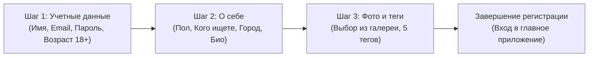

# Экраны приложения Pinder (`src/screens/`)

В приложении реализовано 9 полноценных экранов, охватывающих все этапы пользовательского пути (Customer Journey) — от онбординга и авторизации до свайпов, общения и редактирования профиля.

---

## 1. `WelcomeScreen.tsx` — Приветственный онбординг

Первый экран, встречающий нового или неавторизованного пользователя.

### Ключевая функциональность
- **Фирменный брендинг:** Логотип `pinder` засечным шрифтом Georgia и бейдж «Эстетика встреч».
- **Интерактивный слайдер возможностей:** Карусель ключевых ценностей приложения (`SLIDES`) с фотографиями, тегами и краткими описаниями.
- **Точечная пагинация (Dots):** Показывает активный слайд и позволяет вручную переключаться тапом.
- **Кнопки входа:**
  - `Создать аккаунт` — переход на `RegisterScreen`.
  - `У меня уже есть аккаунт: Войти` — переход на `LoginScreen`.
  - `Войти как гость (Демо-режим)` — быстрый вход без ввода данных через `guestLogin()`.

---

## 2. `LoginScreen.tsx` — Авторизация

Экран входа для зарегистрированных пользователей с защитой от перекрытия интерфейса клавиатурой.

### Ключевая функциональность
- **Интеграция с `KeyboardAvoidingView`:** Автоматический сдвиг формы при открытии виртуальной клавиатуры на iOS и Android.
- **Поля ввода (`Input`):** Email/телефон и пароль с иконками, очисткой и кнопкой переключения видимости пароля.
- **Вспомогательные опции:** Переключатель «Запомнить меня» и ссылка «Забыли пароль?».
- **Демо-подсказка:** Поля предзаполнены валидными учетными данными для ускорения тестирования.

---

## 3. `RegisterScreen.tsx` — Пошаговая регистрация

Трехшаговый мастер создания новой анкеты с валидацией данных на каждом этапе.

### Разбор шагов
1. **Шаг 1: Аккаунт и возраст:** Проверка обязательного имени, валидного email, пароля от 6 знаков и строгого ограничения возраста 18+.
2. **Шаг 2: Данные и предпочтения:** Выбор пола (`Девушка` / `Парень`), кого ищет пользователь (`Парней` / `Девушек` / `Всех`), город проживания и биография (от 10 символов).
3. **Шаг 3: Фото с устройства и теги интересов:**
   - Интеграция с `pickImageFromDevice()`: загрузка личной фотографии из галереи смартфона.
   - Выбор до 5 тегов интересов из списка `POPULAR_TAGS`.
   - Чекбокс согласия с правилами сервиса.

---

## 4. `FeedScreen.tsx` — Главная лента анкет

Центральный экран приложения с физикой свайпов карточек в стиле Tinder/Bumble.

### Ключевая функциональность
- **Колода из двух карточек:** Верхняя интерактивная карточка и слегка уменьшенная подложка следующей карточки (`scale: 0.96`, `opacity: 0.75`), плавно масштабирующаяся при свайпе.
- **Предзагрузка изображений (`Image.prefetch`):** Фоновое кэширование фотографий из анкет для исключения задержек при перелистывании.
- **Обработка жестов `PanResponder`:**
  - Плавное следование за пальцем пользователя.
  - Ограничение смещения вниз с сопротивлением (rubber-band resistance).
  - Срабатывание свайпа при превышении 25% ширины экрана (`SWIPE_THRESHOLD`).
- **Интерполяции:** Вращение карточки (до ±16°), появление зеленого штампа «LIKE» / «НОРМ» и красного «NOPE» / «СТРЁМ».
- **Модальные окна:**
  - `MatchModal`: праздничное окно взаимной симпатии с анимацией пульсирующего сердца.
  - `FilterModal`: модальное окно настройки пола, расстояния и возраста без перехода на отдельный экран.

---

## 5. `LikesScreen.tsx` — Симпатии и взаимные пары

Сетка пользователей, проявивших интерес к профилю.

### Ключевая функциональность
- **Сегментированный фильтр (`SegmentedControl`):**
  - «Все симпатии» (с бейджем общего количества).
  - «Взаимно» (пары, готовые к общению).
- **Двухколоночная адаптивная сетка (`FlatList numColumns={2}`):** Фотографии с градиентным затемнением, именем, возрастом и тегом.
- **Быстрые действия на карточке:**
  - Для односторонних симпатий: пропустить (крестик) или ответить взаимностью (сердечко).
  - Для взаимных пар: кнопка быстрого перехода в диалог («Написать»).
- **Детальный просмотр анкеты в BottomSheet:** По тапу на карточку открывается всплывающее окно с полной биографией, списком интересов и идеальным свиданием.

---

## 6. `ChatsScreen.tsx` — Список диалогов

Экран со списком активных переписок и каруселью новых пар.

### Ключевая функциональность
- **Карусель «Новые пары» (Stories-формат):** Верхняя горизонтальная лента с круглыми аватарами взаимных совпадений, с которыми еще не начат активный диалог.
- **Мгновенный поиск (`Input`):** Фильтрация диалогов в реальном времени по имени собеседника или тексту последнего сообщения.
- **Карточка диалога:** Крупный аватар с онлайн-статусом, галочка верификации, время последнего сообщения, сниппет и бейдж счетчика непрочитанных.

---

## 7. `ChatDialogScreen.tsx` — Диалог с собеседником

Интерактивный экран чата с поддержкой автоскролла, айсбрейкеров и умного автоответчика.

### Ключевая функциональность
- **Облачка сообщений:** Исходящие сообщения окрашены в фирменный коралловый цвет `#FF5757` с двойной галочкой доставки ✓✓; входящие — светлые с темным текстом.
- **Автоматический скролл:** При поступлении нового сообщения список плавно прокручивается вниз (`scrollToEnd`).
- **Быстрые фразы для знакомства (Айсбрейкеры):** Горизонтальная карусель готовых интересных вопросов («Где лучший кофе в городе?», «Какую выставку посоветуешь?»), отправляемых в один тап.
- **Индикатор «печатает...» и реалистичный автоответчик:** При отправке сообщения собеседник через 400 мс включает статус «печатает...» и через 1.2 с присылает осмысленный ответ.
- **Кнопка аудиозвонка:** Имитация защищенного голосового вызова прямо из диалога.

---

## 8. `ProfileScreen.tsx` — Профиль пользователя

Полноценная страница анкеты с галереей, рейтингом и предпросмотром.

### Ключевая функциональность
- **Эстетичная герой-карточка:** Крупное фото с градиентом, имя, возраст, бейдж верификации и статус «В сети».
- **Плашка рейтинга анкеты:** Индикатор привлекательности анкеты («Рейтинг анкеты: 98%»).
- **Блок статистики:** Счетчики отправленных симпатий, взаимных пар и процент заполнения профиля.
- **Галерея фотографий:** Сетка дополнительных lifestyle-снимков с кнопкой загрузки нового фото с устройства.
- **Карточки-промпты в стиле Hinge/Raya:** Разделы «Мой идеальный выходной» и «Мой трек в Spotify».
- **Режим «Предпросмотр карточки»:** Показывает, как именно анкета пользователя выглядит в колоде ленты у других людей.
- **Режим редактирования:** Интерактивное изменение имени, возраста, города, биографии и смена главного фото.

---

## 9. `SettingsScreen.tsx` — Настройки приложения

Экран тонкой настройки параметров поиска, приватности и аккаунта.

### Ключевая функциональность
- **Параметры поиска:** Пол (`Девушек` / `Парней` / `Всех`), слайдер радиуса поиска (1–100 км), слайдер возраста (18–55 лет).
- **Уведомления:** Переключатели push-уведомлений о симпатиях, сообщениях и тактильного отклика.
- **Приватность:** Режим «Невидимка» (скрытие профиля из общей ленты) и переключатель показа статуса «В сети».
- **Управление данными:** Сброс истории свайпов, безопасный выход из профиля и удаление учетной записи с подтверждением.
